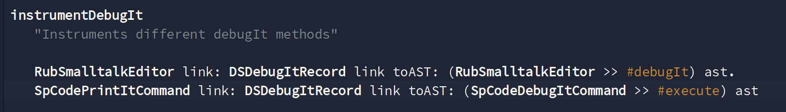
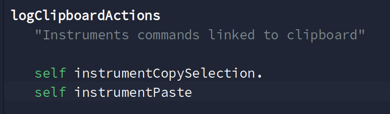
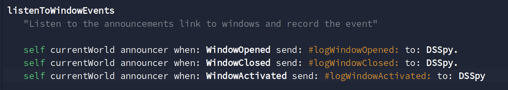
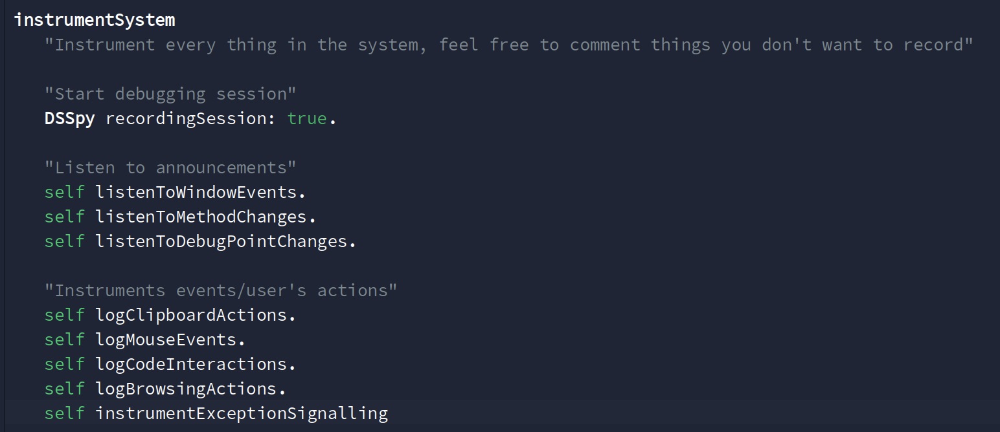
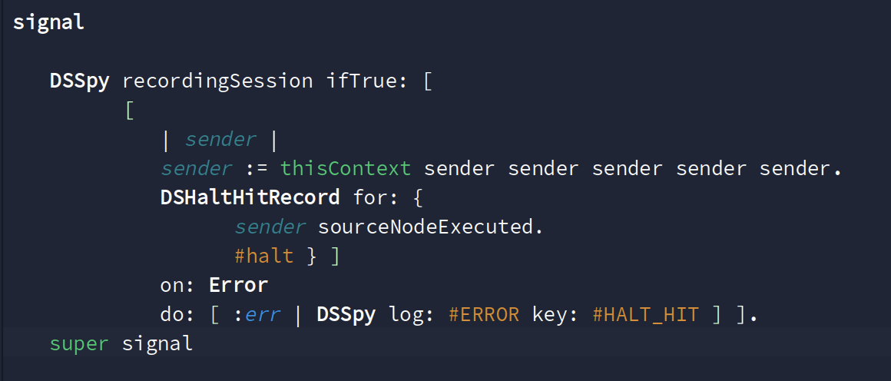

# Documentation for developers

## Commands

### Start instrumentation

In order to start the instrumentation of your Pharo IDE, you must checkout the branch corresponding to your Pharo's version and then load the baseline.

When it's done, run the following line to instrument the system:
```Smalltalk
DSSpyInstrumenter instrumentSystem
```

After that, the system starts logging.
Logs are serialized in the image working directory, in the *ds-spy* folder. You can access it with 'System' -> 'File Browser' then in the 'Bookmarks' section click on 'Working directory'.

### Stop instrumentation 

When you want to stop the instrumentation, you can run the following code:

```Smalltalk
DSSpyInstrumenter stopInstrumentation
```

The system will stops logging and all instrumentation will be removed. 
If you want to re-instrument your system, you can go back to the point before.

### Log data to a remote server

The first step are the same but in addition you need to configure the information about the server on which you want to log your data. 

TODO (when the code will be ready)

### Materialize raw logs

First, you need to get the reference to your log file: it should be in *ds-spy* from your working directory. Then execute the following code:

```Smalltalk
raw := DSSpy materialize: 'ds-spy/file_with_records' asFileReference
```
where `file_with_records` is your log file.

Upon inspection, you obtain a raw list of event, chronologically sorted:


### Build event history

The history is obtained by executing:

```Smalltalk
history := DSRecordHistory on: raw
```

The history object exposes an API to explore the logged execution: (TODO: the API should be documented)


## Overview

Debugging Spy is a tool with many objects interacting together. Let's classify Debugging Spy's components.

### Instrumentation

#### `DSSpyInstrumenter` 

This class is responsible of the instrumentation of the system. You must use it to instrument your Pharo environment with class methods `instrumentSystem` and `stopInstrumentation`. 

Methods are organized in different categories: 

- `instrumentSomething` methods instruments a specific action, such as "Debug it", by using Metalinks.



- `logSomething` groups some `instrumentSomething` methods by categories, for example clipboard actions which include "Paste" and "Copy" actions.



- `listenToSomething` listens to announcements linked to a group of events, for example `listenToWindowEvents` is listening for "window opened", "window closed" and "window activated" events.



Note that the `instrumentSystem` method calls every instrumentation methods for now, but one future goal is to allow users to choose what should be recorded or not. 



#### `DSSpy` 

It is mostly defining rules about instrumentation: does the code written has to be recorded? and the clipboard content? class' names? ... This class is also providing helper's methods for other classes in the package.

The provided API of `DSSpy class` is:

- `#recordClipboardContent` indicates if the clipboard's content should be recorded or not.
- `#recordSourceCode` indicates if the source code selected, when doing actions like "Do It", should be recorded.
- `#recordingSession` indicates if you are currently in a recording session.

#### `DSMetaLink` 

These are specific MetaLinks for instrumentations done by Debugging Spy. It allows us to differentiate them from the classic MetaLinks.

`DSMetaLink` and `DSMetaLinkInstaller` just inherits from `MetaLink` and `MetaLinkInstaller` respectively. The only difference is that `DSMetaLinkInstaller` reinstalls links when an instrumented method is modified (so the instrumentation is not deleted).

#### Commands

For Debugger commands instrumentation, Debugging Spy use its own command system. 
It is very similar to recording classes, the difference is in the way of instrumenting (here by an extension in the Debugger).

Likewise, we replace Sindarin's commands by commands from Debugging Spy which allow us to record every user's actions with Sindarin.

TODO: put pictures of code? Not good for clarity (too many methods called)

#### Extensions

Some instrumentations are done by adding extensions to existing code.
For example, `Halt` class is instrumented with:



As you can see, we used `DSSpy class>>#recordingSession` in order to unsure that we are in a recording session before recording.

This way of recording actions avoids issues due to MetaLink or Announcements and seems to be the best way of recording when it is possible to use it.

### Recording

Many recording classes exist in Debugging Spy. Indeed, wanted data are different from an action to another.
So each recording class implement what data do we want to record and how they should be recorded.

All records inherit from `DSAbstractEventRecord` and are then classify by abstract classes. 
For example, we have `DSClipboardCopyRecord` (recording the action of copying) which inherits from `DSClipboardActionRecord` (the recording category) and then this super class inherits from `DSAbstractEventRecord`.

Here is an example of the hierarchy view in the browser : TODO add screenshots or schema

The main methods in recording class are: 

- `DSAbstractEventRecord class >> for:` which is the entry point for recording (used for instrumentation)
- `DSAbstractEventRecord >> record: anObject` which is re-defined by its subclass and specified what is recorded

### Storing and visualization

#### `DSRecordRegistry` 

This object stores records during a recording session.

#### `DSSTONFileLogger` 

It logs records as STON file. 

#### `DSRecordHistory`

It builds an history object more readable from a STON file. It shorts records and infers information from them.

`DSRecordHistory` provides an API to sort your records: (maybe to move in the user guide)

- `#absoluteTimeTaken`, returns the absolute time taken to perform the recording of user events, including unmonitoring activities (interruptions or activities outside the IDE).
- `#countDebugActions`, returns how much debug actions have been done by the user (add or remove debugPoint, executing code, steps in debugger and methods created, modified or removed).
- `#timeTaken`, returns the time taken to perform the recording of user events. It is calculated as:
	- last log minus the first log timestamp minus time gaps (or discrepancies)
	- time gaps are calculated as the sum of time differences between two following events with a time delta > 5 min.
	We consider that, if the user did not do anything (basically typing or moving the mouse) for more than 5 min, the she was away from the task.


## Testing

Most of the code is tested. To ensure that, we defined a testing strategy divided in two main categories: test scenarios and classical tests. 

### Classical tests

As in all projects, you will find unit tests and functional tests. 

### Testing scenarios

Testing scenarios were defined to ensure that we correctly record scenarios which often happen during experiments. 

Theses scenarios are describing a succession of actions and the expected results. Our goal is then to match the result. 