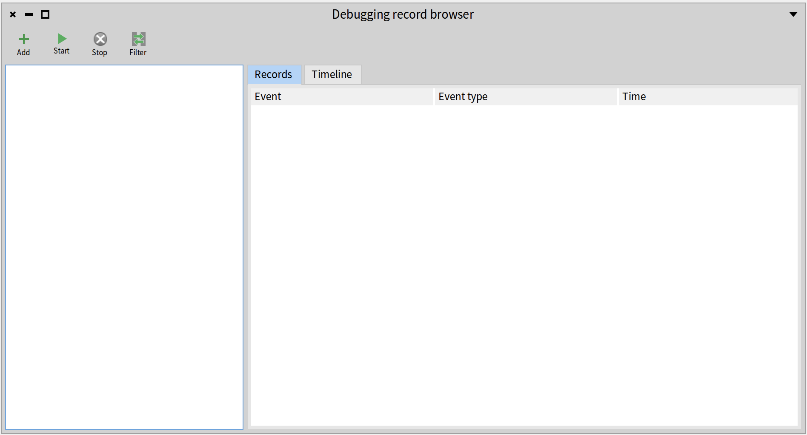
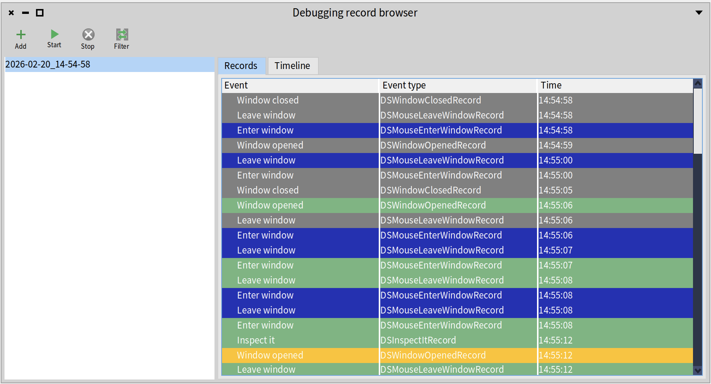
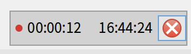
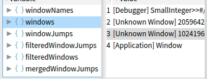
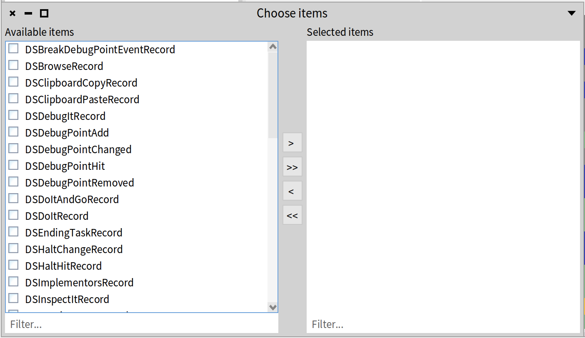

# User Guide


## Installation

You can import Debugging Spy in a Pharo image by running this code in a Playground:

```Smalltalk
Metacello new
    baseline: 'DebuggingSpy';
    repository: 'github://Pharo-XP-Tools/DebuggingSpy:P12';
    load.
```

Caution: the example above loads the P12 version and you should adapt the code according to the version desired. 

## Behavior

Debugging Spy is a tool which instruments a Pharo image by recording user's actions. Events recorded are stored in a *.ston* file locally - on the user's computer - and can be found in the ds-spy directory of the image.

Debugging Spy also provides the possibility to process records into an object called *history*. This object is providing detailed data and has an API to get specific insights.

## User interface

### Open the browser

Debugging Spy comes with a dedicated UI: the Debugging Record Browser. This UI can be opened or closed either by using the added button on the world menu (at the top right of the IDE), or by running the following code in a Playground: 

```smalltalk
DSRecordBrowserPresenter toggleBrowser
```



The following actions can be done by using the interface: 
- add a recording file (or a folder) in the browser
- start a new recording session
- stop the current recording session
- filter displayed records

### Adding records to the browser

New recording files can be added in the browser by clicking on the **Add** button in the toolbar. A dialog will be opened, allowing to select some record files. 

The selected files will be added in the list and displayed on the right part of the screen.



### Coloring the records

As on the previous screenshot, the records displayed in the user interface's table are colored. This color is determined by the window where the event did happen, and every association color / type of window could be seen in the `DSRecordBrowserPresenter >> #getWindowColorFrom` method. This method uses previous defined methods in the `DSWindowRecord` class to determine which color should be used to display the record.

### Starting and stopping the instrumentation

The Debugging Spy instrumentation can be started and stopped by clicking on the associated buttons in the browser's toolbar.

When the instrumentation is started by clicking on the **Start** button, a timer window is instantiated in the bottom-right corner of the screen in order to display the elapsed time since the start of the experiment, the current time and a button which allows to stop the recording session and the instrumentation.




### Visualizing a file's records and history

After selecting a file in the list, you can visualize the corresponding data by doing : 
- `CMD + R` for the raw records.
- `CMD + H` for the associated history.

Upon inspection, the history looks like this:



The history object exposes data organized in different perspectives:

- **records** → list of raw records.  

- **windows** → list of open windows. 

Each window contains its own list of events, a list of events grouped by active periods (i.e. each period marks an interruption in the window's activity) and a toolInfo object (describing the tool associated to the window).

- **windowJumps** → the sequential list of activity per window. 

This allows us to track activity within each window until a switch occurs, showing which window the user jumps to, what they do there, and when they return. Each window jump includes a start event (*startEvent*), an end event (*stopEvent*), a collection of events (*events*) recorded from entry to exit of the window, and the window linked to the activity (*window*, see the previous point). Each window jump corresponds to an activity period from the previous point.  

Some windows may have unusual names, such as:  

- **external window** → a window that was already open before measurements began (typically, in our data, this is the window displaying instructions).  

- **Weird titles like "Color: a color window"** → this is an application window, typically the program being debugged, rather than a tool window.

- Windows that correspond to the opening of a debugger, and only those, have a *source event* indicating which event triggered the window's opening. This applies only at the *window* level, not at the *jump* level. A jump is triggered by a mouse movement from one window to another. To determine the event that triggered the opening of the window being jumped to, one must use *"window sourceEvent"* from the jump.

- The activity records, also referred to as *jumps* or *basic blocks* depending on the context, now respond to *windowId*. This information indicates that the activity was performed in a window of the same id. This is a lazy accessor.

### Filtering displayed records

The records are displayed using their class name, which could also be used to filter the type of records we would like to see (or not). The filter window could be opened by clicking on the **Filter** toolbar's button. Then, any class that is selected to be filtered (has been moved to the filter's right side) would **not** be displayed in the browser.



### Record anonymization

The Debugging Spy API permits to anonymize the records since their data might be sensible.
To make a record anonymous, use the **anonymize** method:
```Smalltalk
aRecord anonymize
``` 

This method will return a **deepCopy** of the specified record that will be filtered based on a filter that is defined in the record's class in the **anonymousFilter** method. This filter defines the slots that are going to be kept in the copy, every slot that is not defined in that filter will be set at nil.


## Quotation

To cite the use of this tool, please use: https://hal.science/hal-04858378v1

```bib
@softwareversion{costiou:hal-04858378v1,
  TITLE = {{Debugging Spy}},
  AUTHOR = {Costiou, Steven and Van{\`e}gue, Adrien},
  URL = {https://inria.hal.science/hal-04858378},
  NOTE = {},
  INSTITUTION = {{Centre Inria de l'Universit{\'e} de Lille}},
  YEAR = {2024},
  MONTH = Dec,
  SWHID = {swh:1:dir:0f63d67301c0ad3174d17c89a13b52e595837877;origin=https://github.com/Pharo-XP-Tools/DebuggingSpy;visit=swh:1:snp:ae7703ee9ee6f77eb10697b7d9fdf90678a768a0;anchor=swh:1:rev:fbec9a14cbdaa478f498196c0f993062441ef3ae},
  VERSION = {1.0},
  REPOSITORY = {https://github.com/Pharo-XP-Tools/DebuggingSpy},
  LICENSE = {MIT License},
  KEYWORDS = {Debug ; Software instrumentation},
  HAL_ID = {hal-04858378},
  HAL_VERSION = {v1},
}
```

## List of recorded events

- Browsing actions: 'Browse', 'Senders' and 'Implementors'.

- Clipboard actions: 'Copy' and 'Paste'.

- Code interactions: 'Debug it', 'Do it', 'Do it and go', 'Inspect it' and 'Print it'.

- Debugger commands (all): 'Step into', 'Step over', 'Through', ...

- Exceptions raised and not caught.

- Halts (all): 'Halt', 'Halt once', 'Halt if', ...

- Mouse events: 'Mouse enter' and 'Mouse leave'. When the mouse is entering or leaving a window.

## Recorded events

| **Type of traces**         | **User activity/block event or action** | **Debugging action** | **Navigation/inspection action** | **Debugging event** | **Code edition action** |
|-----------------------------|------------------------------------------|-----------------------|-----------------------------------|---------------------|--------------------------|
| DebugPoint                 |                                          | x                     |                                   |                     |                          |
| Watch DebugPoint           |                                          | x                     |                                   |                     |                          |
| Halt change                |                                          | x                     |                                   |                     |                          |
| Halt hit                   |                                          |                       |                                   | x                   |                          |
| Clipboard copy             |                                          |                       |                                   |                     | x                        |
| Clipboard paste            |                                          |                       |                                   |                     | x                        |
| Debug it                   | x                                        |                       |                                   |                     |                          |
| Do it                      | ?                                        |                       |                                   |                     |                          |
| Do it and go               | ?                                        |                       |                                   |                     |                          |
| Print it                   |                                          |                       | x                                 |                     |                          |
| Browse                     |                                          |                       | x                                 |                     |                          |
| Implementors               | x                                        |                       |                                   |                     |                          |
| Senders                    | x                                        |                       |                                   |                     |                          |
| Inspect                    | x                                        |                       |                                   |                     |                          |
| Logging error              |                                          |                       |                                   | x                   |                          |
| Method added               |                                          |                       |                                   |                     | x                        |
| Method modified            |                                          |                       |                                   |                     | x                        |
| Method removed             |                                          |                       |                                   |                     | x                        |
| Source code change         |                                          |                       |                                   |                     | x                        |
| Mouse enter window         | x                                        |                       |                                   |                     |                          |
| Mouse leave window         | x                                        |                       |                                   |                     |                          |
| Step                       |                                          | x                     |                                   |                     |                          |
| Window activated           | x                                        |                       |                                   |                     |                          |
| Window opened              | x                                        |                       |                                   |                     |                          |
| Window closed              | x                                        |                       |                                   |                     |                          |
| Proceed command            |                                          | x                     |                                   |                     |                          |
| Restart command            |                                          | x                     |                                   |                     |                          |
| Return value command       |                                          | x                     |                                   |                     |                          |
| Run to selection command   |                                          | x                     |                                   |                     |                          |
| Step into                  |                                          | x                     |                                   |                     |                          |
| Step over                  |                                          | x                     |                                   |                     |                          |
| Step through               |                                          | x                     |                                   |                     |                          |


### Build visualizations
TODO